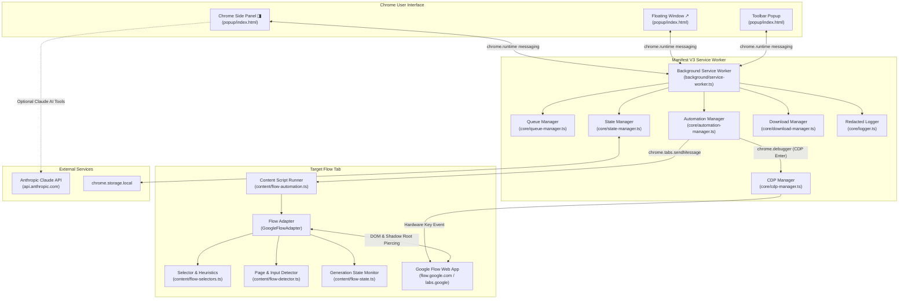

# Google Flow Prompt Automator

<div align="center">


**A production-grade, developer-friendly Chrome Extension (Manifest V3) that automates sequential prompt submission, generation monitoring, and media downloading on Google Flow and related generative media applications.**

[Key Features](#-key-features) •
[Installation](#-installation--quick-start) •
[How to Use](#-how-to-use) •
[Prompt Format Rules](#-prompt-format-rules) •
[UI Modes](#-three-convenient-ui-modes) •
[AI Tools](#-anthropic-claude-ai-suite) •
[Architecture](#-system-architecture) •
[FAQ](#-troubleshooting--faq)

</div>

---

## 💡 Why Flow Prompt Automator?

Google Flow offers state-of-the-art generative media creation, but generating large batches of media requires constant manual prompt entry, clicking buttons, and waiting for generations to finish before entering the next prompt.

Standard browser macros and extensions frequently break on modern web applications because:
1. **Closing the popup halts scripts**: In standard extensions, when you click outside the popup window, the browser terminates the popup process, aborting the automation queue.
2. **Modern frameworks reject synthetic events**: Google Flow uses modern frameworks (React / Lit / ProseMirror) that check `event.isTrusted === true`. Simple JavaScript `.dispatchEvent(new KeyboardEvent('keydown'))` or `.click()` events are often silently ignored.
3. **Complex UI & Shadow DOM**: Flow's UI contains floating prompt boxes, model selectors, and multiple right-arrow icons, requiring precision heuristic targeting and Shadow DOM traversal.

**Google Flow Prompt Automator** solves all of these challenges with a resilient background Service Worker, Chrome DevTools Protocol (CDP) trusted input dispatching, Chrome Side Panel docking, and an isolated DOM selector architecture.

---

## ✨ Key Features

- ⚡ **Sequential Batch Automation**: Automatically types prompts, submits them, monitors generation progress, and advances through your queue.
- ◨ **Chrome Side Panel & Popout Window**: Dock the dashboard in Chrome's native Side Panel or a permanent floating window so the interface **never closes** when interacting with the webpage.
- 🎯 **Target Active Tab with 1 Click**: Explicitly lock automation onto your currently viewed Google Flow tab without relying on guesswork.
- ⌨️ **Trusted Hardware Keystrokes (CDP)**: Dispatches genuine OS-level `Enter` keypresses (`isTrusted: true`) via Chrome DevTools Protocol (`chrome.debugger`), guaranteeing reliable form submission.
- 📄 **Two Input Methods**:
  - **Direct Paste**: Large textarea supporting multi-line prompts separated by blank lines.
  - **Upload .TXT**: Drag-and-drop or file-picker upload for `.txt` prompt files.
- 📏 **Strict Blank-Line Parsing**: Prompts are delimited by blank lines (`\n\n`), while ordinary single line breaks *within* a prompt are safely preserved.
- 🔍 **Smart Generation Detection & Fallbacks**:
  - **Smart Detection**: Observes DOM indicators (progress bars, spinners, button states, video element rendering) to detect when generation is finished.
  - **Fixed Delay**: Predictable time-based cycling fallback.
  - **Timeout Protection**: Strict timeouts prevent the extension from hanging indefinitely.
- 💾 **Automated Result Downloads**: Optional automatic downloading of generated video/media with customizable naming templates (`{index}`, `{timestamp}`, `{date}`).
- 🔄 **Persistent Background Execution**: The automation runs in a Manifest V3 Service Worker; closing the popup does **not** stop or disrupt ongoing automation.
- 🎛️ **Full Lifecycle Controls**: `Start`, `Pause`, `Resume`, `Stop`, `Skip`, `Retry`, `Retry All Failed`, `Reset Progress`, and `Clear Queue`.
- 📊 **Real-Time Progress & Analytics**:
  - Live counts: Total, Completed, Processing, Failed, and Remaining.
  - Animated progress bar with rolling average estimated time remaining (ETA).
- 🧠 **Anthropic Claude AI Suite (Optional)**:
  - Cleanup & Format (fixes grammar/typos while preserving creative intent).
  - Intelligent Splitting of raw unstructured text into formatted prompts.
  - Cinematic Enhancement (lighting, camera angles, textures, lens styles).
  - Custom Transformation instructions.
  - Quality Validation with scoring (0–100).
- 🛡️ **Privacy & Local Security**: Anthropic API keys are stored strictly in Chrome's sandboxed local storage (`chrome.storage.local`) and are automatically redacted from diagnostic logs.
- 🧩 **Isolated Adapter Architecture**: All Google Flow DOM selectors and heuristics live in [`src/content/flow-selectors.ts`](src/content/flow-selectors.ts) for rapid updates if Google modifies Flow's UI.

---

## 🏗️ System Architecture



---

## 📦 Installation & Quick Start

### Prerequisites
- **Google Chrome** (v114+ recommended for Side Panel & CDP support).
- **Node.js** (v18.0.0+ or v20+ recommended).
- **npm** (v9.0.0+).

### Step 1: Clone and Build
```bash
# 1. Clone the repository
git clone https://github.com/<your-username>/flow-prompt-automator.git
cd flow-prompt-automator

# 2. Install dependencies
npm install

# 3. Build production bundle into /dist
npm run build
```
*(The build compiles TypeScript into optimized JavaScript bundles and outputs everything directly into `dist/`.)*

### Step 2: Load Extension into Chrome
1. Open Google Chrome.
2. In the address bar, navigate to:
   ```
   chrome://extensions
   ```
3. In the top-right corner, toggle **Developer mode** to **ON**.
4. In the top-left corner, click **Load unpacked**.
5. Select the **`dist`** directory inside the `flow-prompt-automator` project folder:
   ```
   path/to/flow-prompt-automator/dist
   ```
6. The **Google Flow Prompt Automator** card will appear. Click the **puzzle piece icon** in Chrome's toolbar and **pin** the extension for quick access!

---

## 🪟 Three Convenient UI Modes

Chrome popups close automatically whenever you click outside them. Flow Prompt Automator gives you three ways to interact with the dashboard:

| Mode | How to Open | Best For | Behavior on Click |
| :--- | :--- | :--- | :--- |
| **Chrome Side Panel** | Click **Side Panel ◨** inside the header or open Chrome's Side Panel menu | **Recommended**: Side-by-side workflow while browsing Flow | **Never closes** when clicking the webpage |
| **Pop-out Window** | Click **Pop out ↗** inside the header | Multi-monitor setups or permanent floating dashboard | **Never closes** until you manually exit it |
| **Toolbar Popup** | Click extension icon in Chrome toolbar | Quick queue checks and adjustments | Standard popup behavior |

> [!TIP]
> **Pro Tip**: Dock the extension in the **Side Panel** (`Side Panel ◨`). You can watch Google Flow render videos on the left while monitoring your queue, ETA, and progress bar in real time on the right!

---

## 🚀 How to Use

### 1. Connect to Google Flow
1. Open Google Flow in a browser tab:
   - Primary URL: [`https://flow.google.com`](https://flow.google.com)
   - Google Labs URL: [`https://labs.google/flow`](https://labs.google/flow)
2. Open the **Flow Automator** Side Panel or popup.
3. Check the connection pill in the header:
   - If connected, it displays: `CONNECTED TO FLOW (#<tabId>)`.
   - If you have multiple tabs open, simply click **Target Active Tab** to lock onto the current tab.

### 2. Add Prompts to the Queue
You can add prompts using either of two methods:

#### Method A: Direct Paste
1. Select the **Paste Text** toggle.
2. Paste your prompts into the text area.
3. Ensure prompts are separated by **at least one blank line**.
4. Click **Append to Queue** (to add to existing prompts) or **Replace Queue** (to overwrite).

#### Method B: Upload .TXT File
1. Select the **Upload .TXT** toggle.
2. Drag and drop your `.txt` file onto the drop zone, or click to browse.
3. Review the prompt count detected.
4. Click **Append to Queue** or **Replace Queue**.

*(Ready-to-use sample prompt files are available in the [`examples/`](examples/) directory!)*

### 3. Start Automation
1. Click the green **Start** button in the queue toolbar.
2. The extension will:
   - Focus the Google Flow prompt box.
   - Insert the first prompt via native typing pipelines.
   - Submit the prompt using CDP hardware-level Enter keypresses and smart arrow button clicking.
   - Wait for generation to start and monitor progress.
   - Once completed, optionally download the generated media.
   - Wait for the configured submission delay and advance to the next prompt.

### 4. Queue & Execution Controls
- ⏸️ **Pause**: Safely pauses the loop after the active prompt finishes.
- ▶️ **Resume**: Continues execution from the next pending prompt.
- ⏹️ **Stop**: Terminates automation immediately and safely detaches debugger sessions.
- ⏭️ **Skip**: Skips the currently processing prompt and advances to the next.
- 🔄 **Retry Failed**: Resets all failed prompts back to `PENDING` with a single click.
- 🔁 **Reset Progress**: Resets all prompts back to `PENDING`.
- 🗑️ **Clear**: Clears the entire queue (includes safety confirmation prompt).

---

## 📝 Prompt Format Rules

The prompt parser adheres to strict **blank-line delimiter** rules:

- **Prompt Separator**: One or more blank lines (`\n\n` or `\r\n\r\n`).
- **Internal Line Breaks**: Single line breaks *inside* a prompt are **strictly preserved** (ideal for structured prompts with camera, lighting, and style on separate lines).
- **Whitespace**: Leading and trailing whitespace on individual prompts is trimmed.
- **Empty Lines**: Extraneous blank lines at the start or end of the input are ignored.

### Valid Prompt Example:
```text
Cinematic aerial drone shot of snow-capped mountains at sunrise.
Camera slowly pans downwards to reveal an emerald glacial lake.
8k resolution, 35mm lens, golden hour lighting.

Macro close-up of a neon chameleon on a wet Monstera leaf.
Slow motion, 60fps, shallow depth of field, anamorphic lens flare.

Futuristic Tokyo street at night in heavy cyberpunk rain.
Volumetric neon reflections, holographic billboards, 4k 60fps.
```
*Result: Exactly 3 distinct multi-line prompts parsed.*

---

## 🤖 Anthropic Claude AI Suite

The extension includes an optional AI prompt suite powered directly by Anthropic Claude (Claude 3.5 Sonnet, Claude 3.7 Sonnet, or Claude 3.5 Haiku):

### Features:
1. ✨ **Cleanup & Format**: Repairs awkward grammar, punctuation, and formatting without altering creative direction.
2. ✂️ **Split Into Prompts**: Intelligently extracts distinct prompt concepts from unstructured, rambling text.
3. 🎬 **Cinematic Enhance**: Enriches basic prompts with camera movements (dolly, crane, tracking), lighting conditions (golden hour, volumetric, rim light), and film stocks.
4. 🔍 **Validate Quality**: Scores prompt clarity and completeness (0–100) and highlights missing details.
5. 🪄 **Custom Transformation**: Allows arbitrary transformation instructions (e.g., *"Convert all prompts into 1970s vintage 16mm film footage"*).

### Setup:
1. Navigate to the **Settings** tab.
2. Enter your Anthropic API Key (`sk-ant-...`).
3. Select your preferred Claude model.
4. Click **Save Settings**.
5. Switch to the **AI Tools** tab to transform prompts and send results directly into your queue.

> [!NOTE]
> **Security Guarantee**: Your API key is stored strictly within Chrome's sandboxed local storage (`chrome.storage.local`). It is never transmitted to any third-party server other than direct HTTPS requests to `https://api.anthropic.com/v1/messages`. All diagnostic logs automatically redact sensitive keys.

---

## ⚙️ Configuration Reference

All settings can be customized in the **Settings** tab:

| Setting | Default | Description |
| :--- | :--- | :--- |
| **Submission Delay** | `10s` | Cooldown pause between submitting consecutive prompts. |
| **Maximum Wait Time** | `180s` | Maximum time to wait for a single generation before marking it timed out. |
| **Post-Gen Delay** | `5s` | Delay after generation finishes before downloading or advancing. |
| **Automation Mode** | `Smart Detection` | Choose between DOM-based completion detection or `Fixed Delay`. |
| **Auto-Download Results** | `Disabled` | When enabled, automatically downloads output videos/media. |
| **Download Pattern** | `FlowPrompt_{index}_{timestamp}` | Template tokens: `{index}`, `{timestamp}`, `{date}`. |
| **Anthropic API Key** | `None` | Optional Claude API key for AI prompt enhancement tools. |
| **Claude Model** | `claude-3-5-sonnet-20241022` | Model used for prompt enhancement and transformation. |
| **Custom Flow URL Pattern**| `None` | Regex or domain substring for custom internal Google Labs endpoints. |
| **Verbose Debug Mode** | `Disabled` | Outputs detailed event trace logs to the **Logs** tab and console. |

---

## 🔍 Chrome DevTools Protocol (CDP) & Input Mechanics

### Why CDP is Required
Google Flow's input interface uses advanced web components and rich text editors (such as ProseMirror / Slate / React contenteditable). These frameworks implement event handlers that check:
```javascript
if (!event.isTrusted) {
  // Synthetic JavaScript event created via new KeyboardEvent() -> Ignore!
  return;
}
```

Standard extension `.dispatchEvent()` calls produce synthetic events (`isTrusted === false`). To overcome this without requiring user interaction:

1. **`CdpManager`** attaches Chrome's native debugger API (`chrome.debugger`) to the Google Flow tab.
2. It dispatches genuine hardware-level events through the Chrome DevTools Protocol `Input.dispatchKeyEvent` domain:
   - `rawKeyDown` (VirtualKeyCode 13, `\r`)
   - `char` (VirtualKeyCode 13, `\r`)
   - `keyUp` (VirtualKeyCode 13)
3. Because these events originate from the browser engine, `isTrusted` is `true`.
4. The debugger immediately detaches after dispatching, minimizing browser overhead and clearing Chrome's debugging banner.

> [!WARNING]
> **DevTools Conflict**: If you have Chrome Developer Tools (F12) open directly on the Google Flow tab, Chrome prevents extensions from attaching the debugger. If you encounter this, simply close DevTools on the Flow tab while automation is submitting.

---

## 🧪 Automated Testing

The repository features 40 comprehensive unit tests using Node.js's native test runner (`node:test`):

```bash
# Run all unit tests
npm test
```

### Test Coverage Highlights:
- **`PromptParser`**: Delimiter rules, CRLF line endings, single line break preservation, whitespace trimming, and large batches (500+ prompts).
- **`QueueManager`**: Status transitions, rolling average ETA calculations, append vs replace modes, reordering, failure retries, and skip behavior.
- **`StateManager`**: Settings persistence, queue recovery across popup closures, and storage fallback mock.
- **`CdpManager`**: Protocol command sequencing, debugger attach/detach lifecycle, and graceful handling of existing debugger conflicts.
- **`FlowSelectors`**: Selector hierarchy verification, circular submit button exclusion rules, and generation indicator coverage.
- **`PromptProcessor`**: Anthropic response JSON extraction from raw strings, markdown code fences, and conversational Claude wrappers.

---

## 📁 Project Structure

```
flow-prompt-automator/
├── .github/
│   ├── ISSUE_TEMPLATE/
│   │   ├── bug_report.md          # Bug report template
│   │   ├── feature_request.md     # Feature request template
│   │   └── selector_update.md     # Google Flow DOM selector change report
│   └── pull_request_template.md   # Pull request checklist & template
├── src/
│   ├── background/
│   │   └── service-worker.ts      # Persistent background orchestrator
│   ├── content/
│   │   ├── flow-selectors.ts      # Isolated DOM selectors & heuristics
│   │   ├── flow-detector.ts       # Element visibility & URL verification
│   │   ├── flow-state.ts          # Generation progress detector & timeout guards
│   │   └── flow-automation.ts     # GoogleFlowAdapter implementing FlowAdapter
│   ├── core/
│   │   ├── prompt-parser.ts       # Blank-line delimiter parser & TXT reader
│   │   ├── queue-manager.ts       # Queue lifecycle, statuses & ETA calculations
│   │   ├── automation-manager.ts  # Automation loop orchestrator
│   │   ├── cdp-manager.ts         # Chrome DevTools Protocol keyboard dispatch
│   │   ├── state-manager.ts       # chrome.storage.local persistence & sync
│   │   ├── download-manager.ts    # Filename formatting & Chrome downloads API
│   │   └── logger.ts              # Redacted circular buffer logger
│   ├── anthropic/
│   │   ├── anthropic-client.ts    # Client-side Anthropic Claude API interface
│   │   └── prompt-processor.ts    # Resilient prompt engineering & JSON extraction
│   ├── popup/
│   │   ├── index.html             # Sleek modern dashboard UI
│   │   ├── popup.css              # Custom dark-theme design system
│   │   └── popup.ts               # Popup & Side Panel controller
│   ├── options/
│   │   ├── index.html             # Options page
│   │   ├── options.css            # Options styling
│   │   └── options.ts             # Settings management
│   ├── icons/                     # Extension PNG icons (16, 32, 48, 128)
│   ├── types/
│   │   └── index.ts               # TypeScript interfaces & types
│   └── manifest.json              # Chrome Manifest V3 manifest
├── tests/                         # Unit test suites for all core modules
├── examples/                      # Example prompt batches (.txt)
│   ├── sample-prompts.txt         # General sample prompts
│   ├── cinematic-prompts.txt      # Cinematic camera & lighting prompts
│   └── visual-fx-prompts.txt      # Visual effects & fluid dynamics prompts
├── FLOW_SELECTORS.md              # Detailed guide for DOM selector maintenance
├── CONTRIBUTING.md                # Contributor guide & PR process
├── LICENSE                        # MIT License
├── package.json                   # Project configuration & npm scripts
├── tsconfig.json                  # TypeScript compiler settings
├── build.js                       # Fast esbuild packaging script
├── run-tests.js                   # Node:test test runner
└── generate-icons.py              # Pure Python icon generator
```

---

## ❓ Troubleshooting & FAQ

#### Q: The extension status says "FLOW NOT DETECTED". What should I do?
**A:** Ensure Google Flow is open in a browser tab (`flow.google.com` or `labs.google/flow`). If you have multiple tabs or windows open, click the **Target Active Tab** button in the extension header to lock onto the current tab. If you are accessing Flow via an internal or regional URL, enter your URL substring in the **Settings** tab under **Custom Flow URL Pattern**.

#### Q: Does closing the popup interrupt ongoing automation?
**A:** **No.** The automation loop is executed inside the Manifest V3 Service Worker in the background. You can close the popup, switch tabs, or browse other websites; the extension will continue cycling through prompts.

#### Q: How do I keep the dashboard visible without it disappearing when I click?
**A:** Click the **Side Panel ◨** button in the header. This docks the dashboard into Chrome's native Side Panel, which remains pinned alongside your active web page. Alternatively, click **Pop out ↗** to open a permanent floating window.

#### Q: What does the Chrome banner "Google Flow Prompt Automator is debugging this browser" mean?
**A:** This banner appears momentarily when the extension dispatches an authentic hardware Enter keypress via Chrome DevTools Protocol (`chrome.debugger`). The extension automatically detaches immediately after the keystroke completes, and the banner disappears.

#### Q: What if Google updates Flow's UI and the extension cannot find the prompt box?
**A:** All DOM selectors are cleanly isolated in [`src/content/flow-selectors.ts`](src/content/flow-selectors.ts). Simply inspect the new element in Chrome Developer Tools, add its selector to `flow-selectors.ts`, and run `npm run build`. See [`FLOW_SELECTORS.md`](FLOW_SELECTORS.md) for full instructions.

---

## 🤝 Contributing

Contributions are warmly welcomed! Please read [`CONTRIBUTING.md`](CONTRIBUTING.md) for details on our code of conduct, development setup, test execution, and the pull request submission process.

---

## 📄 License

This project is open-source software licensed under the [MIT License](LICENSE).
